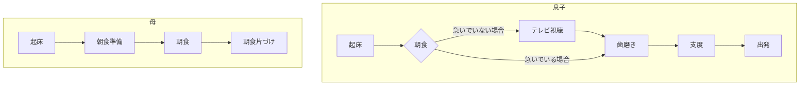
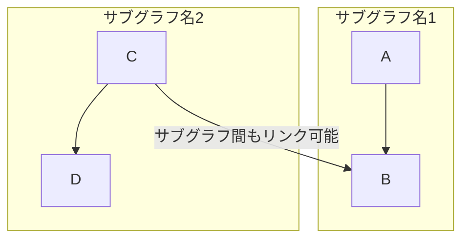

# Astro Starter Kit: Minimal

```sh
npm create astro@latest -- --template minimal
```

[](https://stackblitz.com/github/withastro/astro/tree/latest/examples/minimal)
[](https://codesandbox.io/p/sandbox/github/withastro/astro/tree/latest/examples/minimal)
[](https://codespaces.new/withastro/astro?devcontainer_path=.devcontainer/minimal/devcontainer.json)

> 🧑‍🚀 **Seasoned astronaut?** Delete this file. Have fun!

## 🚀 Project Structure

Inside of your Astro project, you'll see the following folders and files:

```text
/
├── public/
├── src/
│   └── pages/
│       └── index.astro
└── package.json
```

Astro looks for `.astro` or `.md` files in the `src/pages/` directory. Each page is exposed as a route based on its file name.

There's nothing special about `src/components/`, but that's where we like to put any Astro/React/Vue/Svelte/Preact components.

Any static assets, like images, can be placed in the `public/` directory.

## 🧞 Commands

All commands are run from the root of the project, from a terminal:

| Command                   | Action                                           |
| :------------------------ | :----------------------------------------------- |
| `npm install`             | Installs dependencies                            |
| `npm run dev`             | Starts local dev server at `localhost:4321`      |
| `npm run build`           | Build your production site to `./dist/`          |
| `npm run preview`         | Preview your build locally, before deploying     |
| `npm run astro ...`       | Run CLI commands like `astro add`, `astro check` |
| `npm run astro -- --help` | Get help using the Astro CLI                     |

## 👀 Want to learn more?

Feel free to check [our documentation](https://docs.astro.build) or jump into our [Discord server](https://astro.build/chat).




